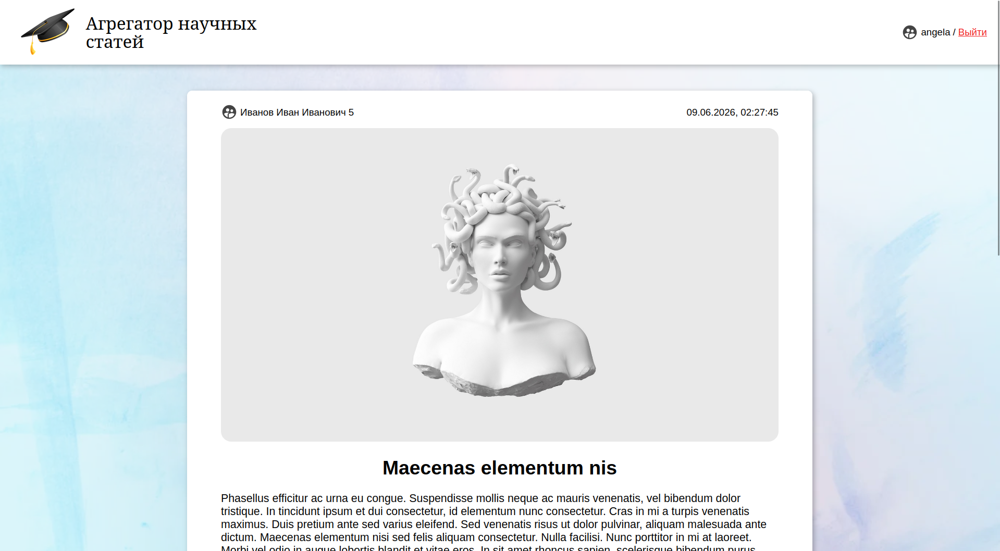
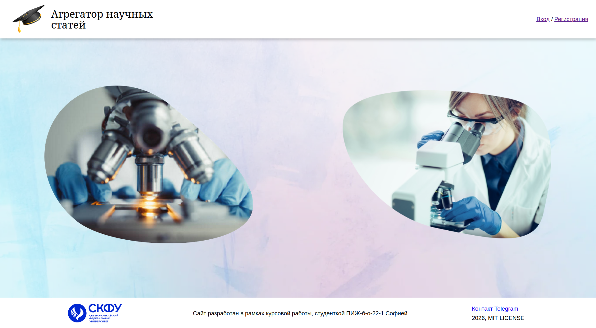
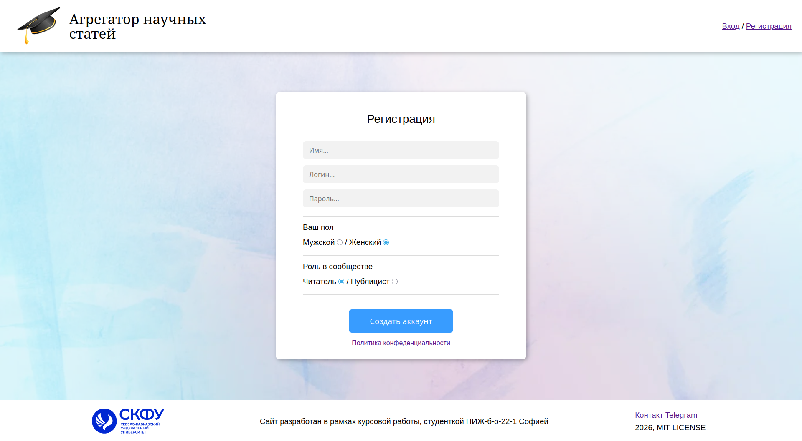

# 📚 ScienceJournal — Курсовой проект

## 📌 Описание проекта

**ScienceJournal** — это веб-приложение (SPA), предназначенное для публикации и чтения научных статей.







Проект реализует платформу с разделением ролей:

- **Читатель (Reader)** — просматривает и читает статьи
- **Публицист (Publisher)** — создаёт и публикует статьи

Архитектура построена по принципу:

- **Frontend:** React SPA
- **Backend:** Node.js + Express REST API
- **Database:** MongoDB
- **Auth:** JWT + cookies
- **Storage:** файловая система для медиа

---

## ⚙️ Используемый стек технологий

| Компонент          | Технология                   |
| ------------------ | ---------------------------- |
| Frontend           | React + React Router DOM     |
| State/API          | Axios (AJAX)                 |
| Backend            | Node.js + Express            |
| Database           | MongoDB (Mongoose)           |
| Auth               | JWT + cookie-parser          |
| Validation         | Zod                          |
| File upload        | Multer (multipart/form-data) |
| Real-time (future) | Socket.io                    |
| Architecture       | Feature-Sliced Design (FSD)  |
| Linting            | ESLint + Prettier            |
| Modules            | ES Modules (ESM)             |

---

## 🧠 Архитектура проекта

Проект разделён на два независимых слоя:

```

/client → React SPA (UI)
/server → REST API + бизнес-логика
/docs → документация и материалы

```

### 📦 Backend структура

```

server/
├── src/
│ ├── routes/ # API маршруты
│ ├── services/ # бизнес-логика
│ ├── entities/ # модели MongoDB
│ ├── middleware/ # auth, session
│ ├── validation/ # Zod схемы
│ └── config/ # MongoDB connection
├── file_storage/ # файлы постов
└── index.js

```

---

### 🎨 Frontend структура (FSD)

```

client/src/
├── pages/ # страницы
├── components/ # UI компоненты
├── features/ # бизнес-фичи (auth, posts)
├── shared/ # UI kit + utils
├── api/ # axios API layer
└── context/ # глобальное состояние

```

---

## 🔐 Авторизация

Используется JWT:

- сервер выдаёт JWT после login/register
- токен сохраняется в cookie
- middleware `verifySession` проверяет токен
- при 401 выполняется logout на клиенте

---

## 📡 API функционал

### Session

- `POST /api/session/auth`
- `POST /api/session/register`
- `POST /api/session/logout`

### Posts

- `GET /api/posts/explore`
- `GET /api/posts/read/:id`
- `POST /api/posts/publish`
- `DELETE /api/posts/:id`

---

## 📂 Файловое хранилище

Медиа-файлы сохраняются локально:

```

server/file_storage/posts/

```

- изображения
- PDF статьи
- имена привязаны к `postId`

---

## 💾 База данных

MongoDB используется для хранения:

- пользователей
- постов
- связей автор → публикация

---

## ⚖️ Почему Node.js вместо Django

В рамках курсового проекта был выбран **Node.js + Express**, а не Django REST Framework по следующим причинам:

### 1. Единый стек JavaScript

- Frontend (React) и backend (Node.js) используют один язык
- упрощается разработка и поддержка

### 2. Более гибкая архитектура API

- Express позволяет строить REST API без ограничений фреймворка
- легко внедрять кастомные middleware (JWT, логирование, ошибки)

### 3. Асинхронная модель

- Node.js идеально подходит для:
  - файловых операций (multer)
  - I/O запросов к MongoDB
  - real-time (Socket.io)

### 4. Быстрая разработка SPA

- меньше "магии" чем в Django
- полный контроль над архитектурой

### 5. Соответствие современному стеку

- MERN-подход (Mongo + Express + React + Node)
- часто используется в индустрии SPA

---

## 🚀 Функциональные возможности

- регистрация и авторизация
- JWT сессии
- роли пользователей (reader / publisher)
- создание публикаций
- загрузка файлов (image + pdf)
- просмотр статей
- пагинация
- модальные уведомления
- глобальные состояния (Context API)
- REST API архитектура
- файловое хранилище
- обработка ошибок (400/401/500)

---

## 📈 Чеклист реализации (основной)

### Backend

- [x] Express сервер
- [x] MongoDB подключение
- [x] JWT авторизация
- [x] Zod валидация
- [x] REST API
- [x] CRUD постов
- [x] multer upload
- [x] cookie-session middleware
- [x] обработка ошибок
- [x] разделение routes/services/entities

### Frontend

- [x] React SPA
- [x] React Router DOM
- [x] Axios API layer
- [x] Context API (auth, modal)
- [x] Feature-Sliced Design
- [x] формы регистрации/логина
- [x] страницы (Auth, Explore, Publish, Read)

---

## 🧩 Дополнительные улучшения (overhead / расширения)

- [ ] Socket.io real-time уведомления
- [ ] лайки и рейтинги постов
- [ ] комментарии
- [ ] поиск и фильтрация
- [ ] кеширование запросов
- [ ] optimistic UI updates
- [ ] refresh-token система
- [ ] CDN для файлов (замена local storage)
- [ ] admin panel
- [ ] rate limiting API
- [ ] pagination infinite scroll
- [ ] тестирование (Jest / Vitest)
- [ ] CI/CD pipeline (GitLab CI)

---

## 🎯 Соответствие курсовой работе

Проект соответствует требованиям:

- SPA приложение ✔
- REST API ✔
- авторизация (JWT) ✔
- CRUD операции ✔
- работа с БД ✔
- клиент + сервер архитектура ✔
- асинхронные запросы ✔
- работа с формами ✔
- загрузка файлов ✔

---

## 🏁 Итог

Проект реализует полноценное современное веб-приложение уровня **"отлично"**, включая:

- разделённую архитектуру frontend/backend
- JWT-аутентификацию
- работу с MongoDB
- файловое хранилище
- модульную структуру (FSD)
- масштабируемую REST API архитектуру

Система легко расширяется до уровня production-проекта (Socket.io, кеширование, microservices).
